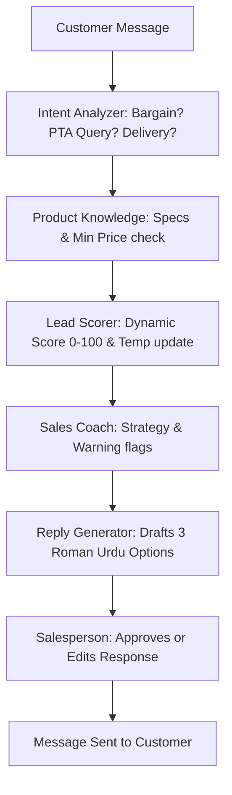

# OLX AI Sales Operating System (Sales OS) — Complete Guide 🚀

Yeh ek AI-powered Sales Operating System hai jo khas tor par **OLX Mobile Phone Dealers** ke liye banaya gaya hai. Iska maqsad dealer ki sales ko barhana, customer responses ko fast karna, aur lead conversion rate ko maximize karna hai.

---

## 🌟 Key Features (Is App me kya kya hai?)

Yeh system 5 specialized AI Agents ke integration se bana hai jo background me kaam karte hain:

1. **Dashboard & Live Analytics (📊):**
   * Apki total active leads, average lead conversion score, sold products, aur general sales activity ka live graph aur counters dikhata hai.

2. **Smart Lead Inbox (📥):**
   * Tamam customer leads ko filter kar ke dikhata hai based on temperature (**HOT**, **WARM**, **COLD**, **SPAM**) aur source (**OLX**, **WhatsApp**, etc.).

3. **Lead Scoring Engine (🎯):**
   * Har lead ko **1 se 100** tak score deta hai aur temperature set karta hai.
   * Agar buyer ka intent deal close karne ka hai to score barh jata hai; agar faltu sawaal ya bad-tameezi ho to system use **SPAM** mark kar deta hai.

4. **AI Reply Generator (⚡):**
   * Customer ke message ke mutabiq **Roman Urdu, Urdu, ya English** me professional replies generate karta hai.
   * Yeh reply product specifications, condition, aur dealer ki set ki hui minimum price limits ko follow karta hai.

5. **AI Sales Coach (🧠):**
   * Har customer ke behaviour profile ke mutabiq salesperson ko advice karta hai. 
   * Jaise ke: *"Customer price bargainer hai, isko free delivery offer karein magar specifications par compromise na karein."*

6. **Product Catalog Manager (📱):**
   * Apne inventory items (Brand, Model, Condition, Battery Health, PTA Approval status, aur Minimum Price) manage karne ka platform.

---

## ⚙️ Setup Instructions (Isko Kaise Chalana Hai?)

Humne apke local environment ke liye setup bohot simple kar diya hai:

### 1. Requirements:
* **Node.js** (v18 ya isse upar)
* **npm** (Package Manager)

### 2. Environment Setup (`.env` file):
Project folder ke andar `.env` file ko check karein. Isme do important chezain hain:
```env
DATABASE_URL="file:./dev.db" # SQLite local database path
OPENAI_API_KEY="apki_openai_api_key_yahan_ayegi" # AI processing ke liye key
```
> [!IMPORTANT]
> AI agents ko live chalane ke liye apko `.env` file me apni **OpenAI API Key** daalna lazmi hai.

### 3. Quick Run Commands:
Humne database setup aur seed complete kar diya hai. Ab sirf dev server ko start karna hai:
* Dev Server chalane ke liye command line me run karein:
  ```bash
  npm run dev
  ```
* Apne browser me **[http://localhost:3000](http://localhost:3000)** open karein.

---

## 🔄 How It Works? (Ye Kaam Kaise Karta Hai?)

Apka system ek standard automated cycle par chalta hai jab bhi koi customer message karta hai:



### Flow ki Tafseelat:
1. **Mock Simulator:** Live testing ke liye chat box me aik *"Send Mock Buyer"* simulator dia gaya hai. Ap wahan roman urdu me customer ki taraf se message send kar sakte hain (e.g., *"bhai pta approved he? battery health kya he?"*).
2. **AI Processing:** Message send hote hi, system context ko analyze karta hai aur:
   * Database se exact specifications check karta hai (e.g. Battery health is 87%).
   * Lead score ko barhata ya kam karta hai.
   * Teen (3) mukhtalif draft options generate karta hai jinhe aap select ya edit kar sakte hain.
3. **Approve & Send:** Jab aap reply review kar ke **Approve & Send** dabaate hain, to woh seller ka final message ban jata hai.

---

## 🔌 OLX Integration (OLX se attach kaise karein?)

Live customers ke messages receive aur process karne ke liye is project ko OLX API se connect karna hota hai. Iski complete guide niche darj hai:

### Step 1: OLX Developer Account & API Access
* Apko **OLX Developer Portal** par register hona hoga aur dealer account ke credentials collect karne honge.
* OLX apko **Client ID**, **Client Secret**, aur **API Access Tokens** dega.

### Step 2: Webhook Configuration
Webhook ek aisa system hota hai jo OLX par naye messages aate hi hamare server par automatic HTTP request bhejta hai.
1. OLX Developer Portal par Webhooks section me jayein.
2. Naye Webhook ka URL hamare server ka API endpoint set karein:
   ```
   https://apka-domain.com/api/ai/analyze
   ```
3. Event type me **`NEW_MESSAGE`** aur **`NEW_LEAD`** ko select karein.

### Step 3: API Route for Incoming Messages
Hamare project me `/api/ai/analyze` aur `/api/conversations/[id]/messages` routes ready hain. Jab bhi OLX webhook event trigger hoga, yeh endpoints automatically:
* Customer ki profile retrieve karenge.
* Chat details ko database me check/update karenge.
* AI pipeline ko run kar ke salesperson ko live screen par notification aur suggestions dikhayein ge.

### Step 4: WhatsApp Business API Linking (Optional)
Agar aap is system ko WhatsApp ke liye bhi chalana chahte hain:
1. **Meta Developer Console** par ja kar WhatsApp Business API set up karein.
2. WhatsApp Webhook URL ko bhi hamare messages API endpoint par point karein.
3. WhatsApp message incoming payloads ko parse kar ke `ConversationChannel.WHATSAPP` channel save karein.
