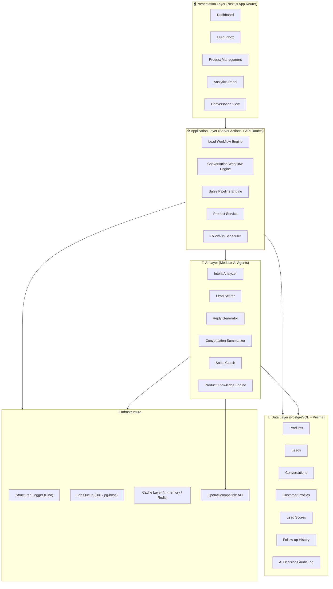
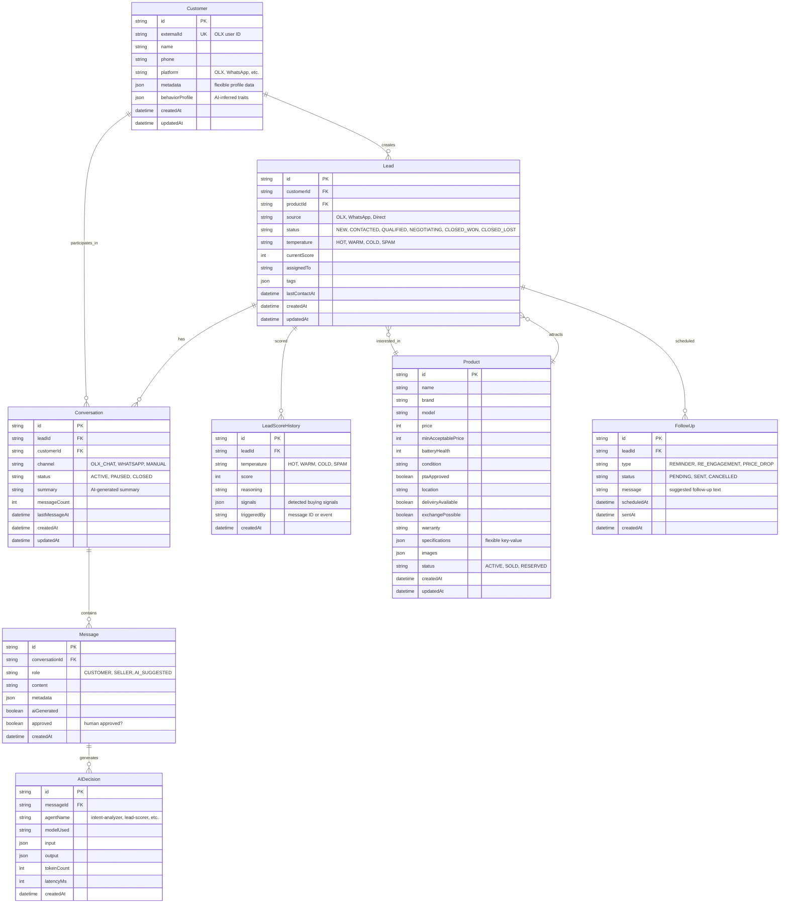
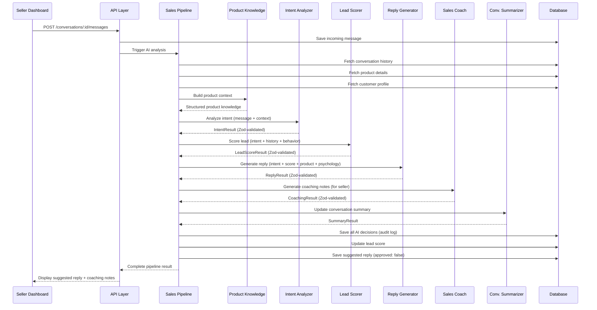
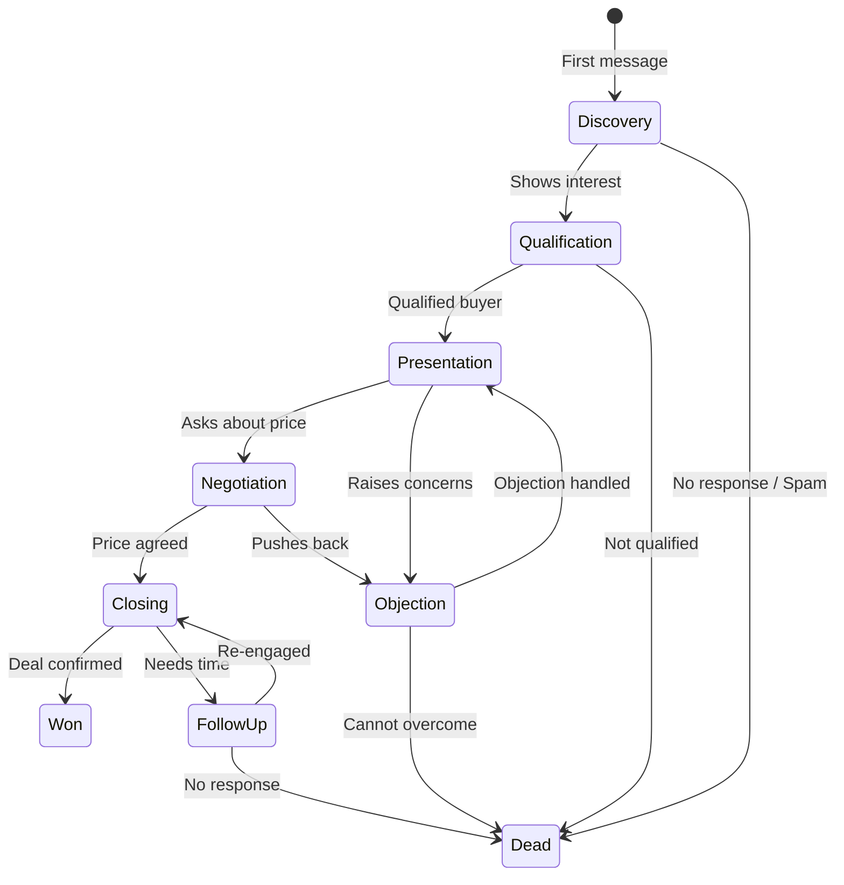

# OLX AI Sales Operating System — Architecture Document

> **Mission:** Build a production-grade AI Sales Operating System that maximizes conversions for an OLX-based mobile phone business by understanding customer psychology, qualifying leads, and generating persuasive, human-like responses.

---

## Table of Contents

1. [System Architecture Overview](#1-system-architecture-overview)
2. [Folder Structure](#2-folder-structure)
3. [Database Schema & Prisma Models](#3-database-schema--prisma-models)
4. [API Design](#4-api-design)
5. [AI Workflow & Agent Architecture](#5-ai-workflow--agent-architecture)
6. [Human Psychology Layer](#6-human-psychology-layer)
7. [Security Considerations](#7-security-considerations)
8. [Scaling Strategy](#8-scaling-strategy)
9. [Implementation Roadmap](#9-implementation-roadmap)
10. [Verification Plan](#10-verification-plan)

---

## 1. System Architecture Overview

### High-Level Architecture



### Design Principles

| Principle | Implementation |
|:---|:---|
| **TypeScript-first** | Every module, schema, and config is TypeScript. No `any`. Strict mode. |
| **Schema-first AI** | All AI inputs/outputs defined as Zod schemas. No free-form JSON parsing. |
| **Clean Architecture** | Strict layering: Presentation → Application → AI/Domain → Data → Infrastructure |
| **Modular AI** | Each AI capability is a self-contained module with its own schema, prompt, and service. |
| **Human-in-the-loop** | AI suggests; human approves. Every AI decision is auditable. |
| **Configuration over code** | Business rules (pricing thresholds, scoring weights) live in config, not code. |
| **Observable by default** | Structured logging (Pino) on every AI decision, API call, and state transition. |

### Why These Technology Choices

| Technology | Justification |
|:---|:---|
| **Next.js 15 (App Router)** | Full-stack framework: SSR dashboard + API routes + Server Actions in one codebase. React Server Components for data-heavy dashboard pages. |
| **PostgreSQL** | Relational integrity for lead/conversation data. JSONB for flexible product attributes. Mature ecosystem for CRM workloads. |
| **Prisma** | Type-safe ORM generates TypeScript types from schema. Migration system. Query builder for complex joins. |
| **Zod** | Runtime validation + TypeScript type inference. Used for API input validation AND OpenAI structured output schemas. Single source of truth. |
| **Pino** | Fastest structured logger for Node.js. JSON output for production log aggregation. |
| **OpenAI-compatible API** | Provider-agnostic design. Works with OpenAI, Azure OpenAI, Ollama, LM Studio, or any compatible endpoint. |

---

## 2. Folder Structure

```
olx-ai-assistant/
├── prisma/
│   ├── schema.prisma              # Database schema
│   ├── migrations/                # Prisma migrations
│   └── seed.ts                    # Seed data (sample products, test leads)
│
├── src/
│   ├── app/                       # Next.js App Router
│   │   ├── layout.tsx             # Root layout (fonts, global providers)
│   │   ├── page.tsx               # Landing / redirect to dashboard
│   │   ├── globals.css            # Global design tokens & styles
│   │   │
│   │   ├── (dashboard)/           # Route group: authenticated dashboard
│   │   │   ├── layout.tsx         # Dashboard shell (sidebar, nav)
│   │   │   ├── page.tsx           # Dashboard home (KPIs, recent activity)
│   │   │   ├── leads/
│   │   │   │   ├── page.tsx       # Lead inbox (filterable list)
│   │   │   │   └── [id]/
│   │   │   │       └── page.tsx   # Single lead detail + conversation
│   │   │   ├── products/
│   │   │   │   ├── page.tsx       # Product catalog
│   │   │   │   └── [id]/
│   │   │   │       └── page.tsx   # Product editor
│   │   │   ├── conversations/
│   │   │   │   └── page.tsx       # Conversation explorer
│   │   │   └── analytics/
│   │   │       └── page.tsx       # Analytics dashboard
│   │   │
│   │   └── api/                   # API Route Handlers
│   │       ├── leads/
│   │       │   ├── route.ts       # GET (list), POST (create)
│   │       │   └── [id]/
│   │       │       └── route.ts   # GET, PATCH, DELETE single lead
│   │       ├── products/
│   │       │   ├── route.ts       # GET, POST
│   │       │   └── [id]/
│   │       │       └── route.ts   # GET, PATCH, DELETE
│   │       ├── conversations/
│   │       │   ├── route.ts       # GET, POST
│   │       │   └── [id]/
│   │       │       ├── route.ts   # GET single conversation
│   │       │       └── messages/
│   │       │           └── route.ts  # POST new message → triggers AI pipeline
│   │       ├── ai/
│   │       │   ├── analyze/
│   │       │   │   └── route.ts   # POST: full AI pipeline (intent + score + reply)
│   │       │   ├── intent/
│   │       │   │   └── route.ts   # POST: intent analysis only
│   │       │   ├── score/
│   │       │   │   └── route.ts   # POST: lead scoring only
│   │       │   └── suggest-reply/
│   │       │       └── route.ts   # POST: reply generation only
│   │       └── health/
│   │           └── route.ts       # GET: health check
│   │
│   ├── modules/                   # Feature-driven business modules
│   │   ├── leads/
│   │   │   ├── lead.service.ts    # Lead CRUD + business logic
│   │   │   ├── lead.actions.ts    # Next.js Server Actions
│   │   │   ├── lead.schemas.ts    # Zod schemas for lead validation
│   │   │   └── lead.types.ts      # TypeScript types (derived from Zod)
│   │   ├── products/
│   │   │   ├── product.service.ts
│   │   │   ├── product.actions.ts
│   │   │   ├── product.schemas.ts
│   │   │   └── product.types.ts
│   │   ├── conversations/
│   │   │   ├── conversation.service.ts
│   │   │   ├── conversation.actions.ts
│   │   │   ├── conversation.schemas.ts
│   │   │   └── conversation.types.ts
│   │   ├── customers/
│   │   │   ├── customer.service.ts
│   │   │   ├── customer.schemas.ts
│   │   │   └── customer.types.ts
│   │   └── analytics/
│   │       ├── analytics.service.ts
│   │       ├── analytics.schemas.ts
│   │       └── analytics.types.ts
│   │
│   ├── ai/                        # AI Layer — modular agents
│   │   ├── core/
│   │   │   ├── ai-client.ts       # OpenAI-compatible client (provider-agnostic)
│   │   │   ├── ai-config.ts       # Model selection, temperature, token limits
│   │   │   └── prompt-builder.ts  # Composable prompt construction
│   │   ├── agents/
│   │   │   ├── intent-analyzer/
│   │   │   │   ├── intent-analyzer.agent.ts   # Agent logic
│   │   │   │   ├── intent-analyzer.schema.ts  # Zod output schema
│   │   │   │   ├── intent-analyzer.prompt.ts  # System + few-shot prompts
│   │   │   │   └── intent-analyzer.types.ts   # TypeScript types
│   │   │   ├── lead-scorer/
│   │   │   │   ├── lead-scorer.agent.ts
│   │   │   │   ├── lead-scorer.schema.ts
│   │   │   │   ├── lead-scorer.prompt.ts
│   │   │   │   └── lead-scorer.types.ts
│   │   │   ├── reply-generator/
│   │   │   │   ├── reply-generator.agent.ts
│   │   │   │   ├── reply-generator.schema.ts
│   │   │   │   ├── reply-generator.prompt.ts
│   │   │   │   └── reply-generator.types.ts
│   │   │   ├── conversation-summarizer/
│   │   │   │   ├── summarizer.agent.ts
│   │   │   │   ├── summarizer.schema.ts
│   │   │   │   ├── summarizer.prompt.ts
│   │   │   │   └── summarizer.types.ts
│   │   │   ├── sales-coach/
│   │   │   │   ├── sales-coach.agent.ts
│   │   │   │   ├── sales-coach.schema.ts
│   │   │   │   ├── sales-coach.prompt.ts
│   │   │   │   └── sales-coach.types.ts
│   │   │   └── product-knowledge/
│   │   │       ├── product-knowledge.agent.ts
│   │   │       ├── product-knowledge.schema.ts
│   │   │       ├── product-knowledge.prompt.ts
│   │   │       └── product-knowledge.types.ts
│   │   └── pipeline/
│   │       ├── sales-pipeline.ts      # Orchestrates agents in sequence
│   │       ├── pipeline.schemas.ts    # Pipeline input/output schemas
│   │       └── pipeline.types.ts
│   │
│   ├── lib/                       # Shared infrastructure
│   │   ├── prisma.ts              # Singleton Prisma client
│   │   ├── logger.ts              # Pino structured logger
│   │   ├── env.ts                 # Zod-validated environment variables
│   │   ├── errors.ts              # Custom error classes
│   │   └── utils.ts               # Shared utilities
│   │
│   ├── config/                    # Business configuration (not code)
│   │   ├── sales-rules.ts         # Scoring weights, thresholds, reply tone
│   │   ├── intent-taxonomy.ts     # All recognized intents
│   │   └── pricing-rules.ts       # Negotiation boundaries
│   │
│   └── components/                # Shared React UI components
│       ├── ui/                    # Primitives (Button, Card, Badge, etc.)
│       ├── layout/                # Shell, Sidebar, Header
│       ├── leads/                 # Lead-specific components
│       ├── products/              # Product-specific components
│       ├── conversations/         # Chat UI, message bubbles
│       └── analytics/             # Charts, KPI cards
│
├── .env.example                   # Environment variable template
├── .env.local                     # Local environment (gitignored)
├── next.config.ts                 # Next.js configuration
├── tsconfig.json                  # TypeScript config (strict)
├── package.json
├── eslint.config.mjs
└── README.md
```

### Why This Structure

- **`src/modules/`** separates business logic from UI and infrastructure. Each module is self-contained with its own schemas, services, and server actions.
- **`src/ai/agents/`** treats each AI capability as an isolated agent with dedicated prompt, schema, and logic files. This enables independent testing, prompt iteration, and model swapping per agent.
- **`src/ai/pipeline/`** orchestrates agents without coupling them. The pipeline calls agents in sequence, passing structured data between them.
- **`src/config/`** externalizes business rules. Changing a scoring threshold or adding an intent requires zero code changes.
- **`src/app/api/`** provides a clean REST API surface that can be consumed by the dashboard, future mobile apps, or third-party integrations (WhatsApp, OLX API).

---

## 3. Database Schema & Prisma Models

### Entity Relationship Diagram



### Complete Prisma Schema

```prisma
// prisma/schema.prisma

generator client {
  provider = "prisma-client-js"
}

datasource db {
  provider = "postgresql"
  url      = env("DATABASE_URL")
}

// ─── Enums ───────────────────────────────────────────

enum Platform {
  OLX
  WHATSAPP
  DIRECT
  OTHER
}

enum ProductStatus {
  ACTIVE
  SOLD
  RESERVED
  DRAFT
}

enum LeadStatus {
  NEW
  CONTACTED
  QUALIFIED
  NEGOTIATING
  CLOSED_WON
  CLOSED_LOST
}

enum LeadTemperature {
  HOT
  WARM
  COLD
  SPAM
}

enum ConversationChannel {
  OLX_CHAT
  WHATSAPP
  MANUAL
}

enum ConversationStatus {
  ACTIVE
  PAUSED
  CLOSED
}

enum MessageRole {
  CUSTOMER
  SELLER
  AI_SUGGESTED
}

enum FollowUpType {
  REMINDER
  RE_ENGAGEMENT
  PRICE_DROP
  CHECK_IN
}

enum FollowUpStatus {
  PENDING
  SENT
  CANCELLED
  FAILED
}

// ─── Models ──────────────────────────────────────────

model Customer {
  id              String    @id @default(cuid())
  externalId      String?   @unique  // OLX user ID or phone number
  name            String?
  phone           String?
  platform        Platform  @default(OLX)
  metadata        Json?     @default("{}")
  behaviorProfile Json?     @default("{}")  // AI-inferred: price-sensitive, decisive, tire-kicker, etc.

  leads           Lead[]
  conversations   Conversation[]

  createdAt       DateTime  @default(now())
  updatedAt       DateTime  @updatedAt

  @@index([externalId])
  @@index([phone])
}

model Product {
  id                  String        @id @default(cuid())
  name                String        // e.g., "iPhone 13 128GB"
  brand               String        // e.g., "Apple"
  model               String        // e.g., "iPhone 13"
  price               Int           // Listed price in PKR
  minAcceptablePrice  Int?          // Floor price for negotiation
  batteryHealth       Int?          // Percentage (0-100)
  condition           String?       // e.g., "9/10", "Like New"
  ptaApproved         Boolean       @default(false)
  location            String?       // e.g., "Karachi"
  deliveryAvailable   Boolean       @default(false)
  exchangePossible    Boolean       @default(false)
  warranty            String?       // e.g., "3 months seller warranty"
  specifications      Json?         @default("{}")  // Flexible: RAM, storage, color, etc.
  images              Json?         @default("[]")  // Array of image URLs
  status              ProductStatus @default(ACTIVE)

  leads               Lead[]

  createdAt           DateTime      @default(now())
  updatedAt           DateTime      @updatedAt

  @@index([brand])
  @@index([status])
  @@index([price])
}

model Lead {
  id              String          @id @default(cuid())
  customerId      String
  customer        Customer        @relation(fields: [customerId], references: [id], onDelete: Cascade)
  productId       String?
  product         Product?        @relation(fields: [productId], references: [id], onDelete: SetNull)

  source          Platform        @default(OLX)
  status          LeadStatus      @default(NEW)
  temperature     LeadTemperature @default(COLD)
  currentScore    Int             @default(0)  // 0-100
  assignedTo      String?         // Future: team member ID
  tags            Json?           @default("[]")
  notes           String?         @db.Text

  lastContactAt   DateTime?

  conversations   Conversation[]
  scoreHistory    LeadScoreHistory[]
  followUps       FollowUp[]

  createdAt       DateTime        @default(now())
  updatedAt       DateTime        @updatedAt

  @@index([customerId])
  @@index([productId])
  @@index([status])
  @@index([temperature])
  @@index([createdAt])
}

model Conversation {
  id              String              @id @default(cuid())
  leadId          String
  lead            Lead                @relation(fields: [leadId], references: [id], onDelete: Cascade)
  customerId      String
  customer        Customer            @relation(fields: [customerId], references: [id], onDelete: Cascade)

  channel         ConversationChannel @default(OLX_CHAT)
  status          ConversationStatus  @default(ACTIVE)
  summary         String?             @db.Text  // AI-generated summary, updated periodically
  messageCount    Int                 @default(0)

  messages        Message[]

  lastMessageAt   DateTime?
  createdAt       DateTime            @default(now())
  updatedAt       DateTime            @updatedAt

  @@index([leadId])
  @@index([customerId])
  @@index([status])
  @@index([lastMessageAt])
}

model Message {
  id              String      @id @default(cuid())
  conversationId  String
  conversation    Conversation @relation(fields: [conversationId], references: [id], onDelete: Cascade)

  role            MessageRole
  content         String      @db.Text
  metadata        Json?       @default("{}")  // e.g., detected language, sentiment
  aiGenerated     Boolean     @default(false)
  approved        Boolean     @default(true)   // false = AI suggestion pending human review

  aiDecisions     AIDecision[]

  createdAt       DateTime    @default(now())

  @@index([conversationId])
  @@index([createdAt])
}

model LeadScoreHistory {
  id              String          @id @default(cuid())
  leadId          String
  lead            Lead            @relation(fields: [leadId], references: [id], onDelete: Cascade)

  temperature     LeadTemperature
  score           Int             // 0-100
  reasoning       String          @db.Text
  signals         Json?           @default("[]")  // Array of detected buying signals
  triggeredBy     String?         // Message ID or event that triggered re-scoring

  createdAt       DateTime        @default(now())

  @@index([leadId])
  @@index([createdAt])
}

model FollowUp {
  id              String          @id @default(cuid())
  leadId          String
  lead            Lead            @relation(fields: [leadId], references: [id], onDelete: Cascade)

  type            FollowUpType
  status          FollowUpStatus  @default(PENDING)
  message         String          @db.Text  // Suggested follow-up text
  scheduledAt     DateTime
  sentAt          DateTime?

  createdAt       DateTime        @default(now())

  @@index([leadId])
  @@index([status])
  @@index([scheduledAt])
}

model AIDecision {
  id              String    @id @default(cuid())
  messageId       String?
  message         Message?  @relation(fields: [messageId], references: [id], onDelete: SetNull)

  agentName       String    // "intent-analyzer", "lead-scorer", "reply-generator", etc.
  modelUsed       String    // "gpt-4o", "gpt-4o-mini", etc.
  input           Json      // What was sent to the model
  output          Json      // What the model returned (structured)
  tokenCount      Int?      // Total tokens consumed
  latencyMs       Int?      // Response time in milliseconds

  createdAt       DateTime  @default(now())

  @@index([agentName])
  @@index([messageId])
  @@index([createdAt])
}
```

### Schema Design Decisions

| Decision | Rationale |
|:---|:---|
| **CUID IDs** | URL-safe, collision-resistant, better than UUIDs for distributed systems. |
| **Separate `Customer` from `Lead`** | One customer can have multiple leads across different products. Enables cross-selling. |
| **`LeadScoreHistory`** | Tracks score evolution over time. Enables analytics on score trends and conversion correlation. |
| **`AIDecision` audit log** | Every AI call is recorded with input, output, tokens, and latency. Critical for debugging, cost tracking, and compliance. |
| **`behaviorProfile` as JSON** | AI-inferred traits (price-sensitive, decisive, tire-kicker) are flexible and evolve. JSONB allows schema-less evolution. |
| **`minAcceptablePrice` on Product** | Enables the AI to negotiate within boundaries without hardcoding. The seller sets the floor. |
| **Indexed foreign keys** | All FKs and frequently-queried columns are indexed for fast lookups. |
| **`approved` on Message** | Human-in-the-loop: AI suggestions are `approved: false` until the seller accepts. |

---

## 4. API Design

### REST API Surface

All routes under `/api/`. Request/response validated with Zod. Errors follow RFC 7807 Problem Details format.

#### Products

| Method | Route | Description |
|:---|:---|:---|
| `GET` | `/api/products` | List products (filterable: brand, status, price range) |
| `POST` | `/api/products` | Create product |
| `GET` | `/api/products/:id` | Get product details |
| `PATCH` | `/api/products/:id` | Update product |
| `DELETE` | `/api/products/:id` | Soft-delete product |

#### Leads

| Method | Route | Description |
|:---|:---|:---|
| `GET` | `/api/leads` | List leads (filterable: status, temperature, date range) |
| `POST` | `/api/leads` | Create lead (with customer info) |
| `GET` | `/api/leads/:id` | Get lead details with score history |
| `PATCH` | `/api/leads/:id` | Update lead status/assignment |

#### Conversations

| Method | Route | Description |
|:---|:---|:---|
| `GET` | `/api/conversations` | List conversations (filterable: status, channel) |
| `POST` | `/api/conversations` | Create conversation for a lead |
| `GET` | `/api/conversations/:id` | Get conversation with messages |
| `POST` | `/api/conversations/:id/messages` | **Add message → triggers AI pipeline** |

#### AI Pipeline

| Method | Route | Description |
|:---|:---|:---|
| `POST` | `/api/ai/analyze` | **Full pipeline:** intent + score + reply for a message |
| `POST` | `/api/ai/intent` | Intent analysis only |
| `POST` | `/api/ai/score` | Lead scoring only |
| `POST` | `/api/ai/suggest-reply` | Reply generation only |

#### System

| Method | Route | Description |
|:---|:---|:---|
| `GET` | `/api/health` | Health check (DB connection, AI provider status) |

### API Example: Full AI Pipeline

**Request:** `POST /api/ai/analyze`

```json
{
  "conversationId": "clx123...",
  "message": "Bhai last price batao, mujhe aaj lena hai",
  "productId": "clx456..."
}
```

**Response:**

```json
{
  "intent": {
    "primary": "NEGOTIATION",
    "secondary": ["PURCHASE_READINESS"],
    "confidence": 0.92,
    "signals": ["urgency_language", "price_inquiry", "commitment_signal"]
  },
  "leadScore": {
    "temperature": "HOT",
    "score": 85,
    "previousScore": 60,
    "reasoning": "Customer is showing strong purchase intent with urgency ('aaj lena hai') and moving to price negotiation. High conversion probability.",
    "signals": [
      { "signal": "urgency", "weight": 0.3, "evidence": "'mujhe aaj lena hai'" },
      { "signal": "negotiation_initiation", "weight": 0.25, "evidence": "'last price batao'" },
      { "signal": "direct_communication", "weight": 0.15, "evidence": "No small talk, straight to deal" }
    ]
  },
  "suggestedReply": {
    "message": "Bhai bilkul, aapka taste achha hai — yeh piece meri best phones mein se hai. Price already competitive hai market mein. Aap aaj lena chahte hain toh thora sa adjustment ho sakta hai. Location kaun si hai aapki? Agar nearby hain toh aaj hi mil sakte hain 👍",
    "tone": "warm_negotiator",
    "strategy": "Acknowledge urgency, validate choice, hint at flexibility without quoting a number, advance to logistics (location) to create commitment momentum.",
    "alternativeReplies": [
      "Bhai yeh phone ke liye already bohat inquiries aa rahi hain. Aap serious hain toh batao location, direct deal karte hain aaj."
    ]
  },
  "salesCoachNotes": {
    "customerProfile": "Decisive buyer, price-conscious but ready to commit today",
    "recommendedApproach": "Do NOT quote a lower price first. Let the customer anchor. Ask for their budget. Use urgency as leverage.",
    "riskFactors": ["May ghost if price doesn't match expectations"]
  }
}
```

---

## 5. AI Workflow & Agent Architecture

### Agent Pipeline Flow



### Agent Specifications

#### 1. Intent Analyzer

| Property | Detail |
|:---|:---|
| **Purpose** | Classify the customer's intent from their message |
| **Input** | Message text, conversation history (last 10 messages), product context |
| **Output Schema** | `{ primary: IntentEnum, secondary: IntentEnum[], confidence: number, signals: string[] }` |
| **Model** | gpt-4o-mini (fast, cost-effective for classification) |

**Intent Taxonomy:**

```typescript
export const INTENT_TAXONOMY = [
  'AVAILABILITY',           // "Is this available?"
  'PRICE_INQUIRY',          // "What's the price?"
  'NEGOTIATION',            // "Last price?"
  'PRODUCT_DETAILS',        // "Battery health? Storage?"
  'WARRANTY_INQUIRY',       // "Any warranty?"
  'DELIVERY_INQUIRY',       // "Do you deliver?"
  'EXCHANGE_INQUIRY',       // "Exchange possible?"
  'WHATSAPP_REQUEST',       // "WhatsApp number?"
  'LOCATION_INQUIRY',       // "Where are you located?"
  'PTA_STATUS',             // "PTA approved?"
  'PURCHASE_READINESS',     // "I want to buy today"
  'COMPARISON',             // "Do you have other options?"
  'SERIOUS_BUYER_SIGNAL',   // Multiple questions, returning customer
  'OBJECTION',              // "Too expensive", "Condition looks bad"
  'GREETING',               // "Hi, hello"
  'SPAM',                   // Irrelevant, promotional
  'UNKNOWN',                // Cannot classify
] as const;
```

#### 2. Lead Scorer

| Property | Detail |
|:---|:---|
| **Purpose** | Score lead quality (0-100) and classify temperature |
| **Input** | Current intent, conversation history summary, customer profile, score history |
| **Output Schema** | `{ temperature: 'HOT'|'WARM'|'COLD'|'SPAM', score: number, reasoning: string, signals: Signal[] }` |
| **Model** | gpt-4o (needs nuanced reasoning) |

**Scoring Signal Weights (configurable):**

```typescript
export const SCORING_SIGNALS = {
  // Positive signals (increase score)
  urgency: { weight: 30, examples: ['aaj lena hai', 'abhi ready hoon'] },
  multipleQuestions: { weight: 20, examples: ['asking 3+ detailed questions'] },
  negotiationStart: { weight: 25, examples: ['last price?', 'best price?'] },
  locationSharing: { weight: 15, examples: ['I am in XYZ area'] },
  returningCustomer: { weight: 20, examples: ['previous interaction history'] },
  whatsappRequest: { weight: 10, examples: ['send me whatsapp number'] },

  // Negative signals (decrease score)
  onlyGreeting: { weight: -5, examples: ['just hi/hello, no follow-up'] },
  priceOnlyNoFollowUp: { weight: -10, examples: ['asks price, disappears'] },
  spamLanguage: { weight: -50, examples: ['promotional content'] },
  unrealisticOffer: { weight: -15, examples: ['offering 50% below market'] },
} as const;
```

#### 3. Reply Generator

| Property | Detail |
|:---|:---|
| **Purpose** | Generate a persuasive, human-like reply that advances the sale |
| **Input** | Intent result, lead score, product details, conversation history, psychology rules |
| **Output Schema** | `{ message: string, tone: string, strategy: string, alternativeReplies: string[] }` |
| **Model** | gpt-4o (needs high-quality natural language) |

**Key Behavioral Rules (injected via system prompt):**

1. Never sound like a bot. Write like a real Pakistani phone seller on OLX.
2. Use Roman Urdu when the customer uses it. Match their language style.
3. Always ask a follow-up question to keep the conversation alive.
4. Never give a final price in the first response. Create a negotiation dynamic.
5. Use social proof when relevant ("bohat inquiries aa rahi hain").
6. Match urgency with action ("aaj mil sakte hain").
7. Build product value before discussing price.
8. Never ignore an objection. Acknowledge and reframe.

#### 4. Conversation Summarizer

| Property | Detail |
|:---|:---|
| **Purpose** | Generate a concise summary of the conversation for quick review |
| **Input** | Full conversation messages |
| **Output Schema** | `{ summary: string, keyTopics: string[], customerSentiment: string, nextAction: string }` |
| **Model** | gpt-4o-mini (summarization is straightforward) |

#### 5. Sales Coach

| Property | Detail |
|:---|:---|
| **Purpose** | Provide coaching notes to the seller (not visible to customer) |
| **Input** | Intent, score, conversation context, customer profile |
| **Output Schema** | `{ customerProfile: string, recommendedApproach: string, riskFactors: string[], doNot: string[] }` |
| **Model** | gpt-4o (needs strategic reasoning) |

#### 6. Product Knowledge Engine

| Property | Detail |
|:---|:---|
| **Purpose** | Build rich product context from database for other agents |
| **Input** | Product ID |
| **Output** | Formatted product description with all specs, competitive positioning, talking points |
| **Implementation** | Deterministic (no LLM needed). Fetches from DB and formats. |

### Agent Interface Contract

Every agent implements this interface:

```typescript
interface AIAgent<TInput, TOutput> {
  readonly name: string;
  readonly model: string;
  readonly inputSchema: ZodSchema<TInput>;
  readonly outputSchema: ZodSchema<TOutput>;

  execute(input: TInput): Promise<AgentResult<TOutput>>;
}

interface AgentResult<T> {
  success: boolean;
  data: T;
  metadata: {
    model: string;
    tokenCount: number;
    latencyMs: number;
    timestamp: Date;
  };
}
```

---

## 6. Human Psychology Layer

### Sales Psychology Framework

The AI is NOT a customer support bot. It is a **sales assistant** trained in conversational selling techniques specific to the Pakistani OLX marketplace.

#### Psychology Principles Applied

| Principle | How the AI Uses It | Example |
|:---|:---|:---|
| **Reciprocity** | Give value first (detailed product info, honest answers) before asking for commitment | "Battery health 89% hai, almost new feel karega. Aap apne liye le rahe ho?" |
| **Social Proof** | Mention demand/interest from others | "Is phone pe already 4-5 inquiries hain, popular model hai" |
| **Scarcity** | Create urgency naturally (not fake) | "Yeh last piece hai is color mein" |
| **Commitment & Consistency** | Get small yeses before asking for the big yes | First: "Location?" → Then: "Time?" → Then: "Deal confirmed?" |
| **Liking** | Mirror the customer's communication style | If they write in Roman Urdu, respond in Roman Urdu |
| **Authority** | Position as a knowledgeable seller | "Main 3 saal se phones deal kar raha hoon, yeh model reliable hai" |

#### Objection Handling Matrix

| Objection | Detection Signal | Response Strategy |
|:---|:---|:---|
| "Too expensive" | `NEGOTIATION` + negative price sentiment | Acknowledge → Reframe value → Compare market → Ask budget |
| "Condition looks bad" | `OBJECTION` + condition concern | Validate → Offer video call → Highlight specific condition details |
| "No warranty?" | `WARRANTY_INQUIRY` + hesitation | Explain seller warranty → Offer testing period → Build trust |
| "I'll think about it" | `OBJECTION` + delay signal | Acknowledge → Create soft urgency → Ask what's holding them back |
| "Can you deliver?" | `DELIVERY_INQUIRY` | Confirm availability → Propose meetup → Offer delivery options |
| "Show me other options" | `COMPARISON` | Upsell → Show alternatives → Position current product's advantage |

#### Conversation Stage Detection



The Reply Generator adapts its tone and strategy based on which stage the conversation is in:

| Stage | AI Behavior |
|:---|:---|
| **Discovery** | Warm, helpful, asks qualifying questions |
| **Qualification** | Probing, understanding needs, matching products |
| **Presentation** | Highlighting value, building excitement |
| **Negotiation** | Strategic, anchoring, creating win-win |
| **Objection** | Empathetic, reframing, providing evidence |
| **Closing** | Action-oriented, logistics-focused, confirming details |
| **Follow-up** | Gentle, value-adding, re-engaging |

---

## 7. Security Considerations

### Data Protection

| Area | Measure |
|:---|:---|
| **Environment Variables** | All secrets (DB URL, API keys) in `.env.local`, validated with Zod at startup. App crashes if config is invalid. |
| **API Key Security** | OpenAI keys never exposed to client. All AI calls happen server-side. |
| **Input Validation** | Every API endpoint validates input with Zod. No raw user input reaches the database. |
| **SQL Injection** | Prisma's parameterized queries prevent SQL injection by design. |
| **XSS Prevention** | React's default escaping + no `dangerouslySetInnerHTML` unless sanitized. |
| **Rate Limiting** | API routes rate-limited (e.g., 60 req/min per IP) to prevent abuse. |
| **CORS** | Configured for dashboard domain only. No wildcard origins. |

### AI Safety

| Risk | Mitigation |
|:---|:---|
| **Prompt Injection** | Customer messages are wrapped in clearly delineated user content blocks. System prompts are never exposed. |
| **Hallucination** | Product data is injected from database (ground truth). AI cannot invent specs. Zod schema enforces output structure. |
| **Inappropriate Content** | Content moderation check before sending AI-generated replies. |
| **Cost Control** | Token usage tracked per AI decision. Alerts on anomalous spending. Budget caps per model. |
| **Human Override** | All AI suggestions require human approval (`approved: false` by default). Seller can edit before sending. |

### Audit Trail

Every AI decision is logged in the `AIDecision` table with:
- What agent was called
- What input it received
- What output it produced
- How many tokens it consumed
- How long it took

This enables full traceability, cost analysis, and AI behavior debugging.

---

## 8. Scaling Strategy

### Phase-Based Scaling

```mermaid
graph LR
    subgraph Phase1["Phase 1: MVP"]
        Single["Single Instance"]
        PG1["PostgreSQL (local)"]
        OpenAI1["OpenAI API"]
    end

    subgraph Phase2["Phase 2: Growth"]
        Vercel["Vercel Serverless"]
        PG2["Managed PostgreSQL"]
        Redis["Redis (caching)"]
        PGBoss["pg-boss (job queue)"]
    end

    subgraph Phase3["Phase 3: Scale"]
        K8s["Container Orchestration"]
        PG3["PostgreSQL + Read Replicas"]
        Redis2["Redis Cluster"]
        Bull["Bull MQ"]
        Multi["Multi-Model Routing"]
    end

    Phase1 --> Phase2 --> Phase3
```



### Scaling Decisions

| Dimension | Strategy |
|:---|:---|
| **Database** | Start with single PostgreSQL. Add read replicas for analytics queries. Partition `Message` and `AIDecision` tables by date when they exceed 10M rows. |
| **AI Latency** | Use `gpt-4o-mini` for classification/summarization. Reserve `gpt-4o` for reply generation. Cache common intents. Parallel agent execution where possible. |
| **Concurrent Users** | Next.js on Vercel scales horizontally by default. Prisma connection pooling via Prisma Accelerate. |
| **Job Queue** | Background tasks (follow-ups, re-scoring, bulk analysis) via `pg-boss` (uses PostgreSQL as backend, no Redis needed initially). Migrate to BullMQ when volume demands it. |
| **Caching** | In-memory cache for product data (changes infrequently). Redis for session data and frequent lookups when scaling. |
| **Multi-Model** | Route to different models based on task complexity. Simple intent detection → small model. Complex negotiation replies → large model. Self-hosted models for cost optimization at scale. |
| **Cost Optimization** | Track cost per lead. Optimize by caching frequent patterns. Batch non-urgent AI calls. Use cheaper models where quality allows. |

---

## 9. Implementation Roadmap

### Phase 1: Foundation & MVP (Weeks 1–3)

> **Goal:** Working end-to-end pipeline: message in → structured AI analysis out. Dashboard to manage products and view leads.

#### Week 1: Project Setup & Data Layer

- [ ] Initialize Next.js 15 project with TypeScript strict mode
- [ ] Configure Prisma with PostgreSQL
- [ ] Implement complete database schema
- [ ] Create seed script with sample products
- [ ] Set up Pino structured logging
- [ ] Set up Zod-validated environment configuration
- [ ] Create Prisma singleton client

#### Week 2: AI Pipeline & Core Agents

- [ ] Build OpenAI-compatible AI client (provider-agnostic)
- [ ] Implement Intent Analyzer agent
- [ ] Implement Lead Scorer agent
- [ ] Implement Reply Generator agent
- [ ] Implement Product Knowledge Engine
- [ ] Build Sales Pipeline orchestrator
- [ ] Create AI audit logging

#### Week 3: API Layer & Basic Dashboard

- [ ] Build REST API routes (products, leads, conversations, AI)
- [ ] Build dashboard layout shell (sidebar, navigation)
- [ ] Build Product Management page (CRUD)
- [ ] Build Lead Inbox page (list, filter, detail view)
- [ ] Build Conversation View (chat UI + AI suggestions)
- [ ] Build basic Analytics page (KPIs)

---

### Phase 2: Intelligence & Polish (Weeks 4–5)

- [ ] Implement Conversation Summarizer agent
- [ ] Implement Sales Coach agent
- [ ] Add conversation stage detection
- [ ] Build Follow-up scheduling system
- [ ] Add real-time lead score updates
- [ ] Polish dashboard UI (animations, responsive design)
- [ ] Add customer behavior profiling

---

### Phase 3: Integration Ready (Weeks 6–8)

- [ ] WhatsApp Business API integration
- [ ] Webhook receiver for OLX notifications
- [ ] Multi-channel conversation routing
- [ ] Advanced analytics (conversion funnels, AI performance)
- [ ] Automated follow-up execution

---

### Phase 4: Multi-Agent & CRM (Weeks 9–12)

- [ ] Implement Manager Agent (orchestrates specialist agents)
- [ ] Implement Follow-up Agent (autonomous re-engagement)
- [ ] Build CRM features (deal pipeline, revenue tracking)
- [ ] Voice call analysis integration
- [ ] Multi-user support with role-based access

---

## 10. Verification Plan

### Automated Tests

```bash
# Unit tests for AI agents (mock OpenAI responses)
npm run test:unit

# Integration tests for API routes
npm run test:integration

# Database schema validation
npx prisma validate

# Type checking
npx tsc --noEmit

# Linting
npm run lint
```

### Manual Verification

1. **AI Pipeline Test:** Send 20 diverse customer messages through `/api/ai/analyze` and verify:
   - Intent classification accuracy > 90%
   - Lead scoring produces reasonable temperatures
   - Replies are natural, in the right language, and advance the conversation
   - All AI decisions are logged in the database

2. **Dashboard Walkthrough:**
   - Create products via Product Management
   - Create leads and conversations
   - View AI-suggested replies in Conversation View
   - Approve/edit replies
   - Check analytics reflect real data

3. **Edge Cases:**
   - Empty messages
   - Very long messages
   - Messages in Urdu, Roman Urdu, English
   - Spam messages
   - Multiple rapid messages from same customer

---

## Open Questions

> [!IMPORTANT]
> **AI Model Provider:** Which OpenAI-compatible provider do you want to use? Options:
> - OpenAI directly (gpt-4o, gpt-4o-mini)
> - Azure OpenAI
> - Local models via Ollama/LM Studio
> - Other compatible provider
>
> This affects the AI client configuration but NOT the architecture (provider-agnostic by design).

> [!IMPORTANT]
> **PostgreSQL Setup:** Do you have a PostgreSQL instance ready, or should I:
> - Use a Docker Compose setup for local development?
> - Configure for a cloud provider (Supabase, Neon, Railway)?

> [!WARNING]
> **Existing Python Code:** I notice you have Python files open in the editor (FastAPI/Python implementation). This architecture document proposes a **complete TypeScript/Next.js rebuild** as specified in your requirements. The existing Python code will NOT be reused. Please confirm you want to proceed with a fresh TypeScript implementation.

> [!NOTE]
> **MVP Scope Confirmation:** The Phase 1 MVP will deliver:
> - Full AI pipeline (intent → score → reply) via API
> - Product management UI
> - Lead inbox with AI suggestions
> - Conversation view with chat UI
> - Basic analytics
>
> No OLX/WhatsApp integration in Phase 1. All conversations are manually entered or simulated. Is this scope acceptable?
